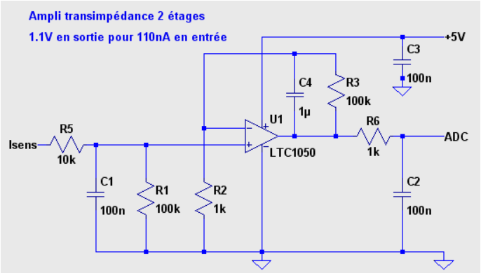
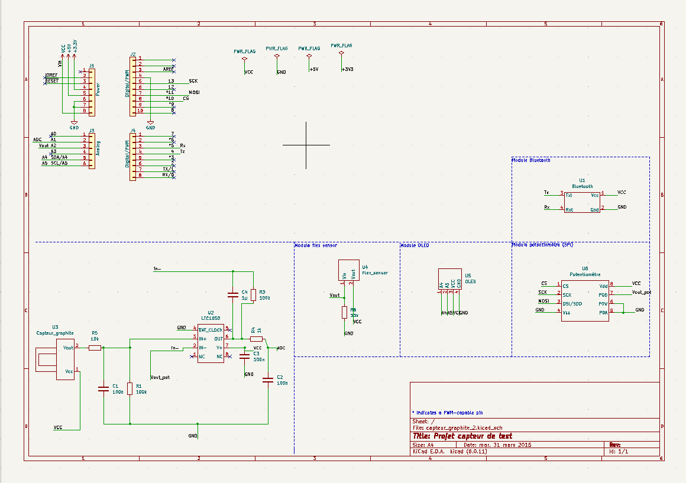
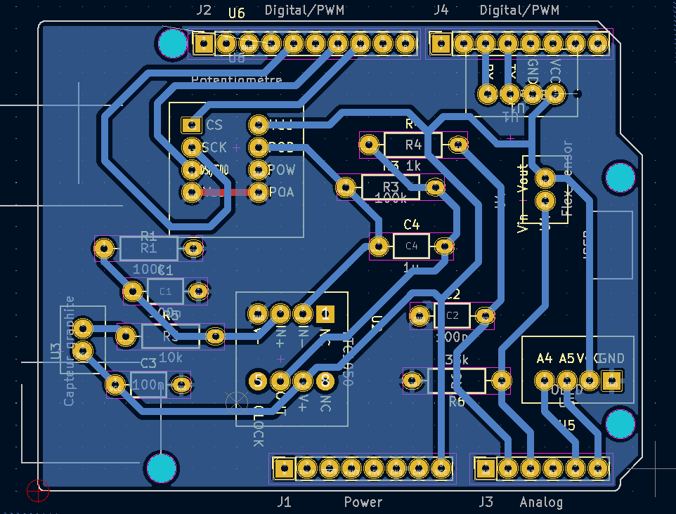

# 2022-2023-4GP-virgile-julie
Projet 4GP du capteur au banc de test en open source hardware
---
## Sommaire
  - [1) Livrables](#1-livrables)
  - [2) Description](#2-description)
  - [3) Shield PCB](#3-shield-pcb)
  - [4) Arduino](#4-arduino)
  - [5) Application Android APK](#5-application-android-apk)
  - [6) Banc de test](#6-banc-de-test)
  - [7) Datasheet](#7-datasheet)
  - [8) limites](#7-limites)
---
## 1) Livrables

Lors de notre projecteur, nous avons décidé de réaliser l'ensemble des options (headers) sur la schématique du shield: 
- capteur
- module bluetooth
- flex sensor
- écran OLED
- potentiomètre digital
 
 Pour se faire, nous avons du réaliser un cahier des charges adaptés:
 
-  Réalisation d'un Shield PCB sur KiCad
-  Réalisation d'un code Arduino permettant la mesure du capteur, ainsi que le réglage du potentiomètre, l'affichage sur un écran OLED, l'envoie des données par module Bluetooth
- Réalisation d'une Application android APK réalisée avec MIT APP INVENTOR
- Réalisation d'une Datasheet du capteur
---
## 2) Description

Dans ce projet, nous allons concevoir un capteur résistif fonctionnant sur la base d'un phénomène physique observé qui est l'effet tunnel. En faisant varier la distance séparant les particules du réseau( par des déformations en compression et en tension), la conductivité du graphite varie ainsi que sa résistivité.

Pour appliquer ce phènomène, la jauge de contrainte sera peu couteuse. Elle se présente sous la forme d’un U en papier, sur lequel on vient déposer du graphite à l’aide d’un crayon à papier ceci est très simple à réaliser et sa fabrication ne génère pas d’impact négatif sur l’environnement. A noter aussi que la réponse du capteur va dépendre du type de mine utilisée. 

Nous avons débuté notre projet par la fabrication de notre shield pour notre chaine de mesures. Ce dernier a été conçu a l'aide du logiciel KICAD  sur la base du amplificateur transimpédance simulation électrique du circuit associé au shield sur le logiciel LTSpice.

    
Par la suite, nous avons ensuite imprimé notre circuit PCB après validation de celle-ci, qui aura demande de multiples essais. 
Puis, nous avons réalisé le montage des composants sur la carte vierge avec le matériel ci-dessous.

Matériel nécessaire
* 1 carte Arduino Uno
* 2 Résistance de 100kΩ
* 1 Résistance de 1kΩ
* 1 Potentiomètre digital MCP-41050
* 2 Condensateurs 100nF
* 1 Condensateurs 1µF
* 1 AOP LTC1050
* 1 Écran OLED01
* 1 Module Bluetooth HC-05

Puis, nous avons codé avec l'usage d'une carte Arduino le code permettant la lecture des mesures du capteur ainsi que l'ajout sur le code des fonctions associés aux différentes options ajoutés soit l'écran OLED, le module Bluetooth et le potentiomètre digital.  
Ensuite, nous avons développé une application Android qui a pour but de recevoir des données via Bluetooth grâce le site MIT App Inventor.  
Et enfin, nous avons réalisé notre propre banc de test : nous avons effectué un test de rayon de courbure et un test de répétabilité avec deux types de crayons (2B, HB2).  

---
## 3) Shield PCB

### Réalisation de la Schématique de Shield
Cette partie se consacre à la réalisation et la fabrication du support éléctronique, soit le PCB de notre projet. Il a été réalisé sur le logiciel Kicad en se basant sur le template d'un arduino uno.

Pour se faire, nous avons conçu l'ensemble des symboles et empreintes associés aux options choisis précédements. Avec les empreintes, nous les avons connecté avec le reste du circuit existant afin d'obtenir notre shield.

### Réalisation de la Schématique du PCB
En se basant sur notre Shield, nous avons réalisé le routage de notre circuit en prenant soin de limiter les distances entre les composantes et leur pins associés. Cette étape fut très laboriseuse car le fait d'avoir une seule couche pour le PCB, nous obligeait de trouver des stratagèmes d'optimisation de place et de placement. Lorsque cette étape était fini, nous pouvons passer à la pose du plan de masse de notre circuit.

Comme nous pouvons le voir, le résultant possède néanmoins un fil supplémentaire, un fil rouge, qui sera ajouté lors de la fabrication du shield pour respecter le plan de masse. 

### Fabrication du PCB
Le PCB a été fabriqué à partir d'une plaquette d’époxy recouverte d’une fine couche de cuivre. 

Etapes de fabrication:

* Réaliser une insolation aux UVs de notre plaquette avec le calque de notre circuit (10 minutes)
* Retirer la partie de résine non isolée avec un révélateur
* Plonger notre plaquette dans un bain de percholorure de fer

### Assemblage des composantes
Lorsque le PCB a été fabriqué, il nous reste l'étape d'assemblage du shield. Pour se faire, il nous faut donc percer le PCB et souder les composants.
Pour ce qui est du perçage, dans les consignes, il était dit de prévoir deux tailles de trous sur le Kicad, soit un de diamètre 0,8mm pour les composants et headers et un de diamètre 1mm pour les broches de connexion de la carte Arduino Uno.

## 4) Arduino
